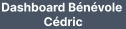

# Dashboard

***En tant qu'étudiant/bénévole*** connecter. 

***Lorsque qu'il est*** sur le dashboard desktop il peut voir
le menu à gauche d'un fond `#485463` prenant la longueur de la page et `287px` de largeur, affichants les onglets suivants: `Messages`, `Calendrier`, `Tâches`.

Le menu doit :

* **Alors** avoir un titre en gras de couleur `#FFFFFF` au dessus, qui fais office de lien pointant sur la page dashboard. 
    * le contenu du titre au dessus du menu sera `Dashboard` + le status utilisateur (`Etudiant`, `Bénévole`) + ***le nom de l'utilisateur connecter***.
      
      

* Alors avoir ses onglets cliquables qui ramène l'utilisateur à leurs page respective, 
    * et doivent au survol avoir un fond `#4D74A3` 

* **Alors** avoir un compteur à gauches de l'onglet `Messages` référencent le nombre de message reçus de l'utilisateur. 
    * la bulle du compteur aura un fond de couleur `#E3A532`..

* Quand la page courante est active **alors** l'onglet de cette page disparait sur le menu.

* **Alors** avoir ses onglets une icone à gauche représentant la page, sauf éxception de l'onglet `Messages` qui aura un compteur qui sera affiché à 0 s'il n'a aucun message en attentes.

***Lorsque qu'il est*** sur le dashboard  mobile il peut voir un menu burger à gauche cliquable permettent d'afficher le même que sur desktop, le menu burger sera de couleur `#485463` etprendra toute la longueur/largeur de la page.
.

***Et*** il peut voir un récapitulatif de ses évènements prévu au premier plan avec un background `#F3FAF1`. 
* [[visual-dashboard#Etudiant évènements visual dashboard desktop]]
* [[visual-dashboard#Bénévole évènements visual dashboard desktop]]

**Et** au second plan avec un background `#FFFFFF` il peut voir les tâches qu'il lui sont attribuées. 
* [[visual-dashboard#Etudiant tâches visual dashboard desktop]]

