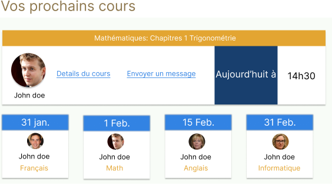
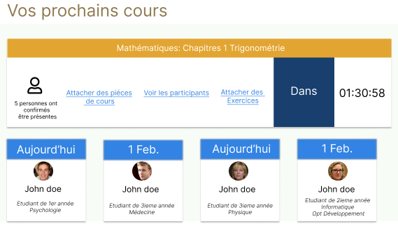

## Etudiant évènements visual dashboard desktop

***En tant qu'étudiant*** connecter. 
***Lorsque qu'il est*** sur le dashboard desktop il peut voir le récapitulatif des cours à venir.

Il y aura

**Alors** des cartes qui apparaissent avec la listes des cours à venir dans le mois.
**Alors** une photo de profile du bénévole qui donnera cours qui sera affiché au milieu de la carte avec en dessous son `nom`, `prénom`. 
**Alors** en dessous de la photo de profile du bénévole la matière qu'il enseignera.
**Alors** la matière qu'il enseignera aura une couleur `#E3A532`.
**Alors** un titre pour chaque cartes qui aura pour contenu la date à laquelle le cours est prévu.

**Et** si le cours doit ce dérouler le jours à laquelle l'étudiant consulte son dashboard et qui se rapproche à 1heure d'interval.

 * **Alors** la vue passera d'un ensemble de carte avec une colonne distinct à une vue sur deux colonnes, l'un possédant le cours qui se jouera à 1heure d'interval et l'autre les cours à venir.

	* Sur cette carte il y aura la photo de profile du `bénévole` ainsi que son nom en bas.
	*  Sur cette carte apparaitre un titre qui aura comme couleur de fond `#E3A532` et aura pour texte `Le numéro du chapitre de la matière son titre`
	* Sur cette carte il pourra voir le `details du cours` qui se jouera.
	*  Sur cette carte il pourra envoyer un message au `bénévole`.
	* Sur cette carte il pourra voir si il y' a des futures exercices attacher à la session qui ce jouera.
	* Sur cette carte il pourra voir le décompte en heure/minutes avant que le cours commence.
	* Sur cette carte il pourra voir avant le décompte en heure/minutes avant que le cours commence un bloque qui sera de fond de coleur `#183F6E` et aura pour contenu aligner au centre le texte "Ajourd'hui à".

## Etudiant tâches visual dashboard desktop

Fonctionnalité: Gérer les tâches sur le dashboard

  Scénario: Consulter les tâches en tant qu'étudiant
    Étant donné que je suis un étudiant connecté
    Lorsque je consulte le dashboard
    Alors je devrais voir la section des tâches

Etudiant:
* Alors je devrais voir les rendus des étudiants pour chaque exercice
* Alors pour chaque rendu, je verrai la description suivante : "Exercice + numéro de l'exercice suivi du nom de la spécialité", suivi du nom du chapitre et de la date de rendu
* Alors pour chaque rendu, je devrais avoir la possibilité de voir la référence du chapitre avec les détails du cours sur desktop
* Alors pour chaque rendu, je devrais avoir la possibilité de rendre l'exercice sur desktop via un bouton situé à droite du nom du chapitre
* Alors pour chaque rendu, sur mobile, je devrais voir ma note sur l'exercice rendu au lieu des boutons

  

## Bénévole évènements visual dashboard desktop

***En tant qu'étudiant*** connecter. 
***Lorsque qu'il est*** sur le dashboard desktop il peut voir le récapitulatif des cours à venir.

il y aura

* ***Alors** des cartes qui apparaissent avec la liste des étudiants inscris à des cours durant le mois.
	* Elles possèderont une `photo de profile` de l'étudiant qui participera au cours, qui sera affiché au milieu de la carte avec en dessous son `nom`, `prénom`, `son année actuellement en cours ainsi que sa spécialité`, `Le cours auquelle il participe`. 

**Et** si le cours doit ce dérouler le jours à laquelle le bénévol consulte son dashboard et qui se rapproche à 1heure d'interval.

* **Alors** la vue passera d'un ensemble de carte avec une colonne distinct à une vue sur deux colonnes, l'un possédant le cours que donnera le bénévol  à 1heure d'interval et l'autre les étudiants qui participeront à un cours à venir durant le mois.
   *   La carte du cours que le bénévol donnera à une heure d'interval aura.
	* Un titre qui aura comme couleur de fond `#E3A532` et aura pour texte `Le numéro du chapitre de la matière son titre`
	*  Le nombre d'étudiant qui auront confirmé participer au cours.
	* Un lien `Attacher des pièces de cours`.
	* Un lien `Voir les participants` qui affichera une modale affichant la `la photo de profile`,`nom`, `prenom`, `specialisation&année`.
	* Un lien `Attacher des exercices` que l'étudiant pourra voir une fois la session terminer.
	* Avant la vue du décompte en heure/minutes commence un bloque qui sera de fond de couleur `#183F6E` et aura pour contenu aligner au centre le texte "Dans".

## Bénévole tâches visual dashboard desktop
Scénario: Consulter les tâches en tant que bénévole
    Étant donné que je suis un bénévole connecté
    Lorsque je consulte le dashboard
    Alors je devrais voir la section des tâches

Bénévole:
* Alors je devrais voir les rendus des étudiants pour chaque exercice que j'ai donné
* Alors pour chaque rendu, je verrai la description suivante : "Exercice + numéro de l'exercice suivi du nom de la spécialité", suivi du nom du chapitre et de la date de rendu
* Alors pour chaque rendu, je devrais avoir la possibilité de voir la référence du chapitre avec les détails du cours sur desktop